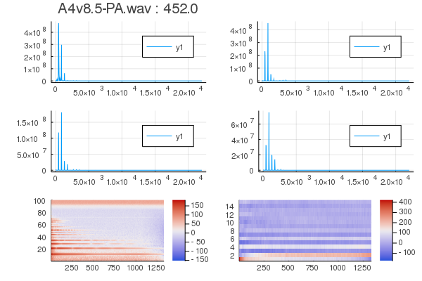

# audio_feature_extraction

This file impletements audio feature extraction techniques while using the less external packages possible. 
Mainly, it aims to obtain Mel Frequency Cepstral Coefficents as well as Deltas and Delta-Deltas of those coefficients. 

"In sound processing, the mel-frequency cepstrum (MFC) is a representation of the short-term power spectrum of a sound, based on a linear cosine transform of a log power spectrum on a nonlinear mel scale of frequency." 
https://en.wikipedia.org/wiki/Mel-frequency_cepstrum

Planning to later expend on this with better documentation and explain the MFCCs extraction process from start to finish. 
Beware, nothing new under the sun, this is project is learning oriented. 
If you have any feedback, keep it coming.  

http://practicalcryptography.com/miscellaneous/machine-learning/guide-mel-frequency-cepstral-coefficients-mfccs/ 
Helped me hack this out. 
Great read. 
Go read it. 

<strong>Using</strong> 

   WAV.jl for reading .wav file  
   FFTW.jl for Discrete Cosine transform ( mydct() is a work in progress) 
   Plots.jl for ... plotting  

<strong>How to use :</strong> 

    λsr, ϕl, powspec, bin, fbankDB, fmfcc, ∇fmfcc, ∇∇fmfcc = generateFeatures(file, preemph = 0.97, ϕl = 0.025, ∇ϕ = 0.01, nfilt=20, num_ceps = 12)
    myplot!(file, powspec, fbankDB, fmfcc, bin, λsr, ϕl, start=1, finish=0, colors="warm")

    
  #   generateFeatures() will return signal features
  
   file = .wav  
   λsr = sample rate 
   premph = pre emphasis filtering coefficient (first filtering of signal)  
   ϕl = window length (adjusted to power of 2 for Cooley Tuckey FFT input constrain) 
   ∇ϕ = hopsize in secs  
   nfilt = number of filters for generating mel scale  
   num_ceps = amount of cepsta to keep 
   filterbanks = Mel space banks of size (nfilt, nframes) 
   fmfcc = Mel Frequency Cepstral Coefficient of size ( num_ceps, nframes) 
   ∇fmfcc = Delta Mel Frequency Cepstral Coefficient of size ( num_ceps, nframes) 
   ∇∇fmfcc = Delta Delta Mel Frequency Cepstral Coefficient of size ( num_ceps, nframes) 
   N = upper range limit for Delta MFCC computation. Usually = 2  
   start/finish = starting/ending range for frame plotting. If finish = 0, plot all frames 
   
 #   myplot!() will return a mosaic of plots
   filename followed by frequency of maximal power spectral density for the first frame of the batch 
   4 bins of the power spectrum (frames 1, 10, 20 and 30) 
   a heatmap of the filter banks 
   a heatmap of the MFCCs 
   
   

Yeah! We have an approx of the fundamental frequency of this piano key while only looking at the max powspec of the first frame of the signal!

  #  General process :
   input signal  
        -> premph filt  
        -> framing  
        -> window transform  
        -> discrete fourrier transform (Cooley Tuckey radix 2 DIT FFT)  
        -> convert to Mel space  
        -> log  
        -> discrete cosine transform 

   For now, only Hamming window is implemented.

